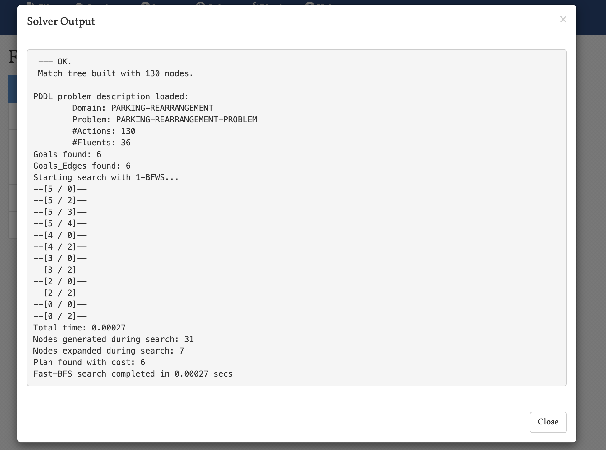
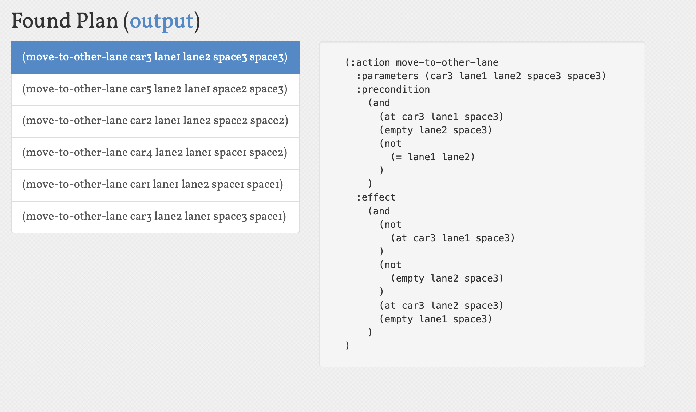

# 指定实验1

## 用 TypeScript 完成车辆搬运规划算法的设计与实现

本项目使用 TypeScript 和 React 实现了一个交互式的车辆重排系统。系统已经部署在 Vercel 平台上，可以通过访问 [https://auto-planning-jackson.vercel.app/](https://auto-planning-jackson.vercel.app/) 直接体验。系统提供了直观的用户界面，支持用户自定义车道数量、车位数量，并可以设置初始状态和目标状态。通过选择不同的算法（BFS或A*），系统能够自动计算最优的移动序列。

1. 规划问题定义
    - 流的描述：
        本规划问题是一个车辆重排问题，通过TypeScript和React实现了一个交互式的车辆重排系统。系统支持用户自定义车道数量、车位数量，并可以设置初始状态和目标状态。系统提供了两种算法（BFS和A*）来求解最优移动序列。
    
    - 动作描述：
        1. 在同一车道内移动：车辆可以在同一车道内向左或向右移动，前提是移动路径上没有其他车辆阻挡
        2. 跨车道移动：车辆可以移动到其他车道的空位，前提是原车道右侧没有阻挡，且目标车道目标位置右侧没有阻挡
    
    - 初始环境：
        系统支持用户通过交互界面设置初始状态，包括：
        1. 车道数量（默认为2）
        2. 每个车道的车位数量（默认为3）
        3. 每个位置上的车辆编号（0表示空位）
    
    - 目标环境：
        用户可以通过交互界面设置目标状态，包括：
        1. 与初始状态相同的车道和车位数量
        2. 期望的车辆分布状态
    
    - 规划生成机制（规划算法）介绍：
        系统实现了两种规划算法：
        1. 广度优先搜索（BFS）：
           - 使用队列进行状态空间搜索
           - 保证找到最短路径（最少移动次数）
           - 使用Set记录已访问状态避免重复搜索
        
        2. A*算法：
           - 使用启发式函数估计到目标状态的代价
           - 启发式函数考虑：
             * 曼哈顿距离：车辆到目标位置的直线距离
             * 车道变换惩罚：跨车道移动增加额外代价
             * 阻挡惩罚：路径上有其他车辆阻挡增加代价
           - 使用优先队列选择最优状态进行扩展

2. 规划程序设计与实现
    - 介绍
        1. 编程语言：TypeScript + React
        2. 运行环境：Web浏览器，支持现代浏览器（Chrome、Firefox、Safari等）
    
    - 运行情况说明
        1. 输入输出说明：
            - 输入：
              * 车道数量（laneCount）
              * 每个车道的车位数量（spaceCount）
              * 初始状态（initialState）：二维数组表示车辆分布
              * 目标状态（targetState）：二维数组表示期望的车辆分布
            
            - 输出：
              * 移动步骤序列：包含每个步骤的详细信息
              * 每个步骤包含：车辆编号、起始位置、目标位置
        
        2. 主要数据结构说明：
            - Move接口：表示一个移动操作
              ```typescript
              interface Move {
                from: { lane: number; space: number };
                to: { lane: number; space: number };
                car: number;
              }
              ```
            
            - State接口：表示系统状态
              ```typescript
              interface State {
                parkingState: number[][];
                moves: Move[];
              }
              ```
            
            - AStarNode接口：A*算法节点
              ```typescript
              interface AStarNode {
                parkingState: number[][];
                moves: Move[];
                g: number;  // 实际代价
                h: number;  // 启发式估计
                f: number;  // 总估计代价
              }
              ```
        
        3. 运行案例：
           系统提供了交互式界面，用户可以：
           1. 设置车道数量和车位数量
           2. 在初始状态和目标状态中输入车辆编号
           3. 选择使用BFS或A*算法求解
           4. 查看详细的移动步骤序列
           5. 实时观察算法执行过程

3. 分析
    - 通用性说明（从算法和规划语言两方面说明）：
        1. 算法通用性：
           - BFS算法适用于任何状态空间搜索问题
           - A*算法通过自定义启发式函数适应不同场景
           - 系统支持任意车道数和车位数的配置
        
        2. 规划语言通用性：
           - TypeScript提供强类型支持，确保代码可靠性
           - React组件化设计，便于扩展和维护
           - 模块化设计，算法和UI逻辑分离
    
    - 完备性说明：
        1. BFS算法保证找到最短路径（如果存在）
        2. A*算法在启发式函数可采纳的情况下保证找到最优解
        3. 系统通过状态空间剪枝避免重复搜索
    
    - 计算复杂度说明：
        1. BFS算法：
           - 时间复杂度：O(b^d)，其中b是分支因子，d是解深度
           - 空间复杂度：O(b^d)，需要存储所有已访问状态
        
        2. A*算法：
           - 时间复杂度：O(|E|)，其中|E|是状态空间大小
           - 空间复杂度：O(|V|)，其中|V|是访问的节点数
    
    - 正确性说明：
        1. 移动规则的正确性：
           - 检查路径阻挡
           - 验证目标位置是否为空
           - 确保车辆可以移出当前位置
        
        2. 状态转换的正确性：
           - 深拷贝避免状态污染
           - 正确更新车辆位置
           - 维护移动历史记录
    
    - 最优性：
        1. BFS算法保证找到最少移动次数的解
        2. A*算法在启发式函数可采纳的情况下保证最优性
        3. 启发式函数设计考虑了：
           - 曼哈顿距离
           - 车道变换代价
           - 阻挡惩罚
    
    - 不足说明：
        1. 性能限制：
           - 状态空间可能随问题规模指数增长
           - 大规模问题可能需要更优的启发式函数
        
        2. 功能限制：
           - 不支持车辆移动的时间成本
           - 不支持车辆移动的物理约束
           - 不支持动态障碍物
        
        3. 用户体验：
           - 大规模问题求解时间可能较长
           - 缺乏可视化动画展示

## 经典规划：用PDDL完成车辆搬运的规划问题描述和测试
1. 规划问题定义
    - 流的描述：
        本规划问题是一个车辆重排问题，涉及在两条车道（lane1和lane2）上重新排列5辆汽车的位置。问题需要在有限的空间内（每个车道3个位置）通过移动车辆来实现目标状态。
    
    - 动作描述：
        1. move-right：将车辆向右移动一个位置
        2. move-left：将车辆向左移动一个位置
        3. move-to-other-lane：将车辆移动到另一条车道的指定位置
    
    - 初始环境：
        车道1（lane1）：car1在space1，car2在space2，car3在space3
        车道2（lane2）：car4在space1，car5在space2，space3为空
    
    - 目标环境：
        车道1（lane1）：car3在space1，car4在space2，car5在space3
        车道2（lane2）：car1在space1，car2在space2，space3为空
    
    - 规划生成机制（规划算法）介绍：
        使用PDDL（Planning Domain Definition Language）进行问题描述，采用STRIPS（Stanford Research Institute Problem Solver）风格的规划方法。该规划器使用前向搜索算法，通过状态空间搜索来寻找从初始状态到目标状态的动作序列。

2. 规划程序设计与实现
    - 介绍
        1. 编程语言：PDDL（Planning Domain Definition Language）
        2. 运行环境：使用FF规划器（Fast Forward）进行规划求解
    
    - 运行情况说明
        1. 输入输出说明：
            - 输入：domain.pddl（定义动作和谓词）和problem.pddl（定义具体问题实例）
            - 输出：规划器生成的解决方案，包括一系列动作序列
        
        2. 主要数据结构说明：
            - 谓词（Predicates）：
                * at(car, lane, space)：表示车辆在特定车道的特定位置
                * empty(lane, space)：表示特定车道的特定位置为空
                * right-of(space1, space2)：表示space1在space2的右边
        
        3. 运行案例：
            
            上图展示了规划器的运行输出，显示了找到的解决方案。
            
            
            上图展示了具体的规划结果，包括所有需要执行的动作序列。

3. 分析
    - 通用性说明（从算法和规划语言两方面说明）：
        1. 算法通用性：该规划方法适用于任何符合STRIPS风格的规划问题，不限于车辆重排问题
        2. 规划语言通用性：PDDL语言可以描述各种规划问题，通过修改domain和problem文件可以适应不同场景
    
    - 完备性说明：
        该规划方法是完备的，如果存在解决方案，规划器一定能找到。这是因为使用了前向搜索算法，可以系统地探索整个状态空间。
    
    - 计算复杂度说明：
        状态空间大小与车辆数量、车道数量和位置数量相关。在最坏情况下，复杂度为O(n!)，其中n为状态空间大小。
    
    - 正确性说明：
        规划器生成的解决方案是正确，因为：
        1. 所有动作都满足前置条件
        2. 动作执行后的效果符合预期
        3. 最终状态满足目标条件
    
    - 最优性：
        该规划器不保证找到最优解，但会找到一个可行的解决方案。如果需要最优解，需要使用其他规划算法。
    
    - 不足说明：
        1. 没有考虑车辆移动的时间成本
        2. 没有考虑车辆之间的碰撞避免
        3. 没有考虑车辆移动的物理约束
        4. 规划结果可能不是最优的
        5. 状态空间可能随问题规模增长而爆炸 