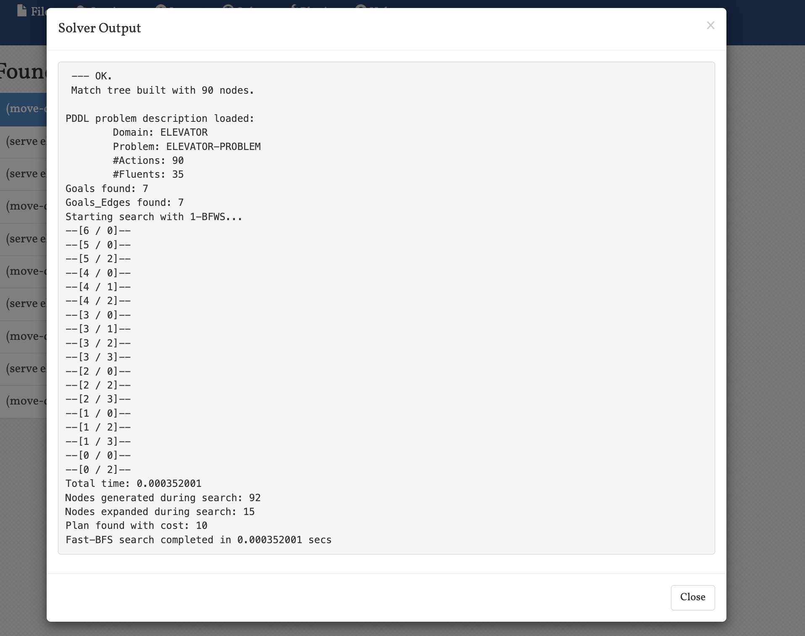
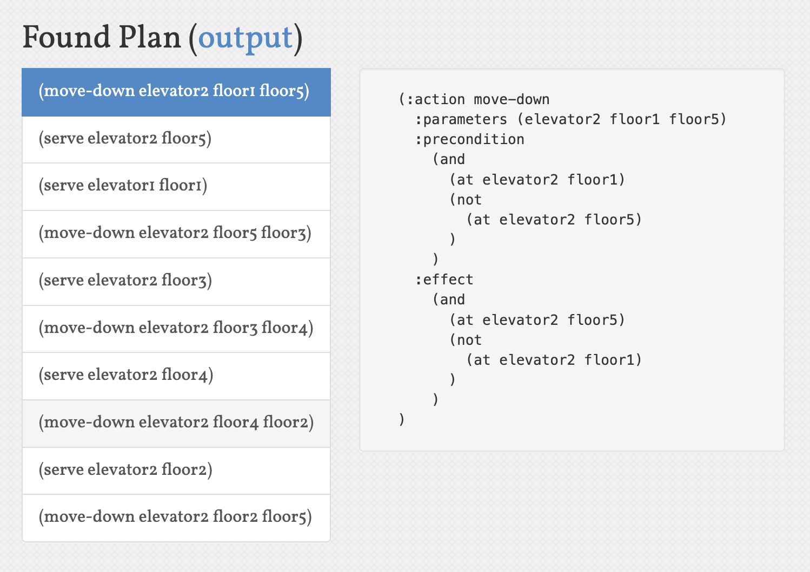

1. 规划问题定义
    - 流的描述：
      本问题涉及一个五层楼、两部电梯的调度系统。系统需要处理所有楼层的服务请求，并最终将电梯分别停靠在指定位置（电梯1在一层，电梯2在五层）。
    
    - 动作描述：
      系统定义了三个基本动作：
      1. move-up：电梯向上移动一层
      2. move-down：电梯向下移动一层
      3. serve：电梯在当前楼层提供服务
    
    - 初始环境：
      - 两部电梯（elevator1和elevator2）初始位置都在一层
      - 所有楼层（1-5层）都有服务请求
      - 所有楼层都未被服务
    
    - 目标环境：
      - 所有楼层都已被服务
      - 电梯1停在一层
      - 电梯2停在五层
    
    - 规划生成机制（规划算法）介绍：
      使用PDDL（Planning Domain Definition Language）进行问题建模，采用STRIPS（Stanford Research Institute Problem Solver）规划系统。该规划器使用前向搜索算法，通过状态空间搜索找到从初始状态到目标状态的最优路径。

2. 规划程序设计与实现
    - 介绍
        1. 编程语言：PDDL（Planning Domain Definition Language）
        2. 运行环境：使用FF规划器（Fast Forward）进行规划求解
    
    - 运行情况说明
        1. 输入输出说明：
           - 输入：domain.pddl（定义问题域）和problem.pddl（定义具体问题实例）
           - 输出：规划器生成的解决方案序列
        
        2. 主要数据结构说明：
           - 谓词（Predicates）：
             * at(elevator, floor)：表示电梯在特定楼层
             * requested(floor)：表示楼层有服务请求
             * served(floor)：表示楼层已被服务
           - 动作（Actions）：
             * move-up/move-down：电梯移动
             * serve：提供服务
        
        3. 运行案例：
           
           上图展示了规划器的运行输出，显示了规划器成功找到了解决方案。
           
           
           上图展示了具体的规划结果，包括电梯的移动序列和服务顺序。

3. 分析
    - 通用性说明：
      1. 算法方面：该规划方法可以扩展到任意数量的电梯和楼层
      2. 规划语言：PDDL提供了清晰的问题建模框架，便于扩展和修改
    
    - 完备性说明：
      只要存在解决方案，规划器就能找到。对于本问题，由于电梯可以自由移动且所有目标都是可达的，因此规划器能够找到解决方案。
    
    - 计算复杂度说明：
      状态空间大小与楼层数和电梯数呈指数关系，但实际运行中由于问题规模较小（5层2部电梯），计算效率较高。
    
    - 正确性说明：
      规划结果满足所有约束条件：
      1. 电梯移动符合物理规则
      2. 所有楼层都被服务
      3. 最终电梯位置符合要求
    
    - 最优性：
      规划器会寻找最短路径（最少动作数）的解决方案，确保在满足所有约束的情况下实现最小代价。
    
    - 不足说明：
      1. 未考虑电梯容量限制
      2. 未考虑乘客等待时间
      3. 未考虑电梯运行时间
      4. 未考虑电梯能耗因素 