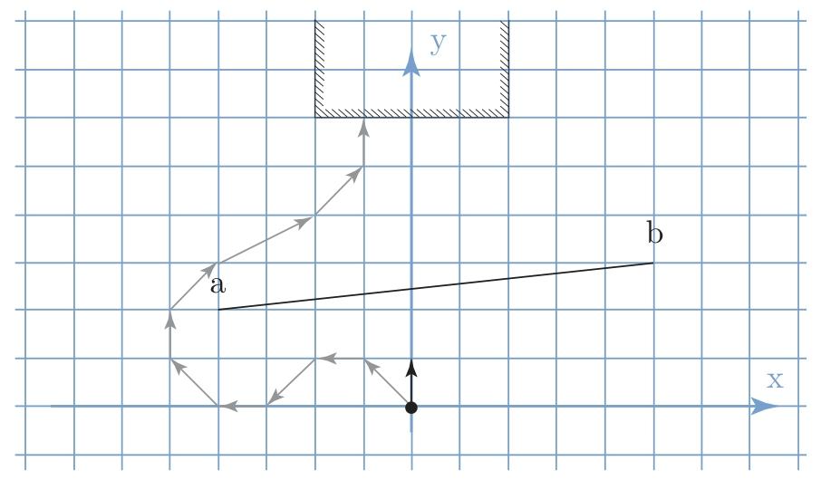

Racetrack is a game, traditionally played with pen on a squared paper [Gardner, 1973]. A car, represented by a point on the grid, moves with a velocity in each dimension ( \((x)\) and y ).At each move, the car can adjust the velocity by ˙1 in one of the dimensions. (The game usually allows for changing both at once; we will model only the case of changing one for simplicity.) The goal is to drive the car around a track, defined by “walls” drawn on the paper, to a finish line, without ever crossing a wall. The game is usually played with two players, each controlling one car, and the winner is the one who reaches a finish line first. Here, we will model a situation with only one car whose goal is to reach a certain area. (In the two-player game, the goal is often to complete a cricuit around a track, which is also possible to encode by using several subgoals, but it more complicated. The two cars must also avoid running into one another.)
<!-- 插入图片 -->

Figure 4.1: A simple example of the racetrack game, and a sample solution. The black point and arrow represent the starting position and velocity of the car. The goal is to avoid the obstacle and reach the centre region at the top, with no velocity in the x direction. The sequence of grey arrows shows a possible path.