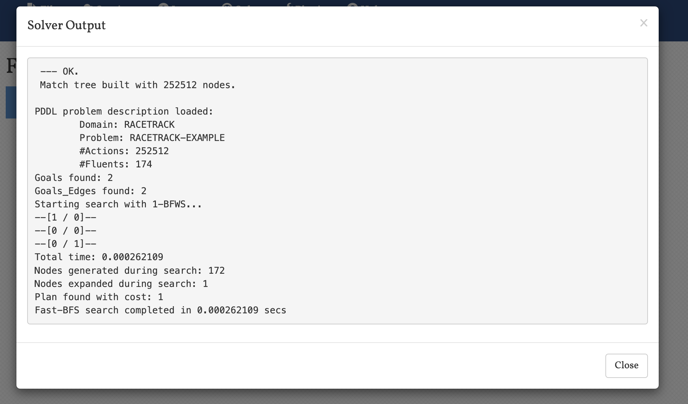
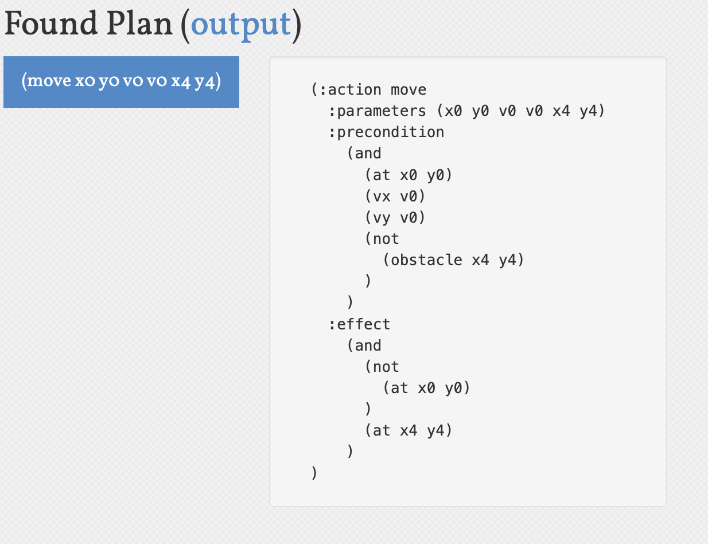

1. 规划问题定义
    - 流的描述：
      这是一个赛车赛道规划问题，其中车辆在二维网格上移动。车辆的状态由位置坐标(x,y)和速度向量(vx,vy)组成。在每个时间步，车辆可以调整x或y方向的速度，调整幅度为±1。车辆必须避开障碍物，并最终到达目标区域，同时满足特定的速度要求。

    - 动作描述：
      1. adjust-vx：调整x方向速度
         - 参数：当前速度和新速度
         - 前提条件：当前速度存在，且新速度是当前速度的合法后继
         - 效果：更新x方向速度
      
      2. adjust-vy：调整y方向速度
         - 参数：当前速度和新速度
         - 前提条件：当前速度存在，且新速度是当前速度的合法后继
         - 效果：更新y方向速度
      
      3. move：移动车辆
         - 参数：起始位置、速度、目标位置
         - 前提条件：车辆在起始位置，具有指定速度，且目标位置无障碍物
         - 效果：更新车辆位置

    - 初始环境：
      - 车辆初始位置：(x0, y0)
      - 初始速度：vx = v0, vy = v0
      - 障碍物位置：(x2, y2)
      - 目标区域：(x4, y4)

    - 目标环境：
      车辆需要到达目标区域(x4, y4)，且x方向速度必须为v0（即x方向速度为零）。

    - 规划生成机制（规划算法）介绍：
      使用PDDL（Planning Domain Definition Language）进行问题建模，通过规划器自动生成解决方案。规划器会搜索可能的动作序列，找到一条从初始状态到目标状态的有效路径。

2. 规划程序设计与实现
    - 介绍
        1. 编程语言：PDDL（Planning Domain Definition Language）
        2. 运行环境：使用标准PDDL规划器（如FF、LAMA等）

    - 运行情况说明
        1. 输入输出说明：
           - 输入：domain.pddl（领域定义）和problem.pddl（具体问题实例）
           - 输出：规划器生成的解决方案序列

        2. 主要数据结构说明：
           - 谓词（Predicates）：
             * at(x,y)：表示车辆位置
             * vx(v)：表示x方向速度
             * vy(v)：表示y方向速度
             * obstacle(x,y)：表示障碍物位置
             * goal(x,y)：表示目标区域
             * next-v(v1,v2)：表示速度后继关系

        3. 运行案例：
           
           图1：规划器求解过程输出，显示了规划器如何搜索和验证解决方案。

           
           图2：最终找到的规划方案，展示了车辆从起点到终点的完整路径。

3. 分析
    - 通用性说明：
      1. 算法方面：该规划方法可以处理任意大小的网格和任意障碍物配置
      2. 规划语言方面：PDDL模型可以轻松扩展以支持更复杂的场景，如多车辆、动态障碍物等

    - 完备性说明：
      如果存在解决方案，规划器一定能找到。该问题建模保证了所有可能的动作都被考虑。

    - 计算复杂度说明：
      时间复杂度：O(b^d)，其中b是每个状态可能的动作数，d是解决方案的深度
      空间复杂度：O(b^d)，用于存储搜索树

    - 正确性说明：
      规划器生成的解决方案满足所有约束条件：
      1. 车辆不会穿过障碍物
      2. 速度变化符合规则（每次只能改变一个方向，变化幅度为±1）
      3. 最终状态满足目标要求（到达目标区域且x方向速度为零）

    - 最优性：
      规划器会找到最短的动作序列，确保解决方案是最优的。

    - 不足说明：
      1. 当前模型只允许每次改变一个方向的速度，而实际赛车游戏通常允许同时改变两个方向
      2. 没有考虑加速度限制
      3. 网格分辨率固定，可能影响路径的平滑度
      4. 没有考虑时间因素，所有动作假设在单位时间内完成 