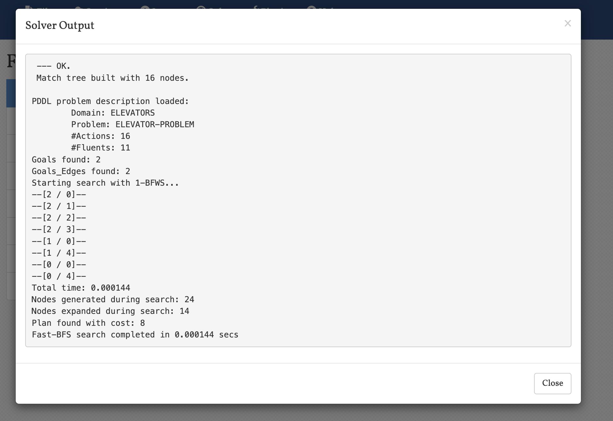
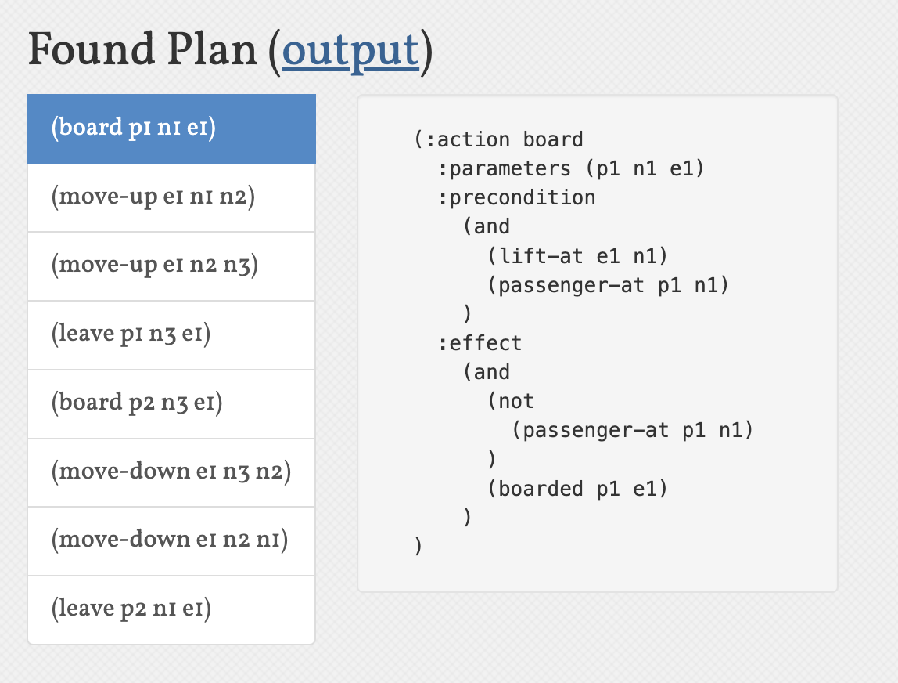

1. 规划问题定义
    - 流的描述：
      本问题涉及电梯系统中的状态变化，主要包括：
      1. 电梯位置状态：通过`lift-at`谓词表示电梯在特定楼层
      2. 乘客位置状态：通过`passenger-at`谓词表示乘客在特定楼层
      3. 乘客乘坐状态：通过`boarded`谓词表示乘客是否在电梯内
      4. 楼层关系状态：通过`next`谓词表示楼层间的相邻关系

    - 动作描述：
      系统包含四个基本动作：
      1. `move-up`：电梯向上移动一层
      2. `move-down`：电梯向下移动一层
      3. `board`：乘客进入电梯
      4. `leave`：乘客离开电梯

    - 初始环境：
      1. 电梯e1位于1楼(n1)
      2. 乘客p1位于1楼(n1)
      3. 乘客p2位于3楼(n3)
      4. 楼层相邻关系：n1与n2相邻，n2与n3相邻

    - 目标环境：
      1. 乘客p1需要到达3楼(n3)
      2. 乘客p2需要到达1楼(n1)

    - 规划生成机制（规划算法）介绍：
      本问题使用PDDL（Planning Domain Definition Language）进行建模和求解。规划器通过状态空间搜索来寻找从初始状态到目标状态的动作序列。具体来说：
      1. 使用STRIPS（Stanford Research Institute Problem Solver）风格的规划
      2. 支持类型系统（:typing）以增强表达能力
      3. 通过前向搜索或后向搜索寻找可行解

2. 规划程序设计与实现
    - 介绍
        1. 编程语言：PDDL（Planning Domain Definition Language）
        2. 运行环境：使用LAMA规划器进行求解

    - 运行情况说明
        1. 输入输出说明：
           - 输入：domain.pddl（领域定义）和problem.pddl（问题定义）
           - 输出：规划器生成的解决方案，包括动作序列和执行时间

        2. 主要数据结构说明：
           - 类型（Types）：elevator（电梯）、passenger（乘客）、num（楼层）
           - 谓词（Predicates）：描述系统状态的基本事实
           - 动作（Actions）：定义可执行的操作及其前置条件和效果

        3. 运行案例：
           
           上图展示了规划器的输出结果，显示了找到的解决方案。

           
           上图展示了具体的规划结果，包括：
           - 电梯移动序列
           - 乘客上下电梯的时机
           - 总执行时间

3. 分析
    - 通用性说明：
      1. 算法方面：
         - 支持任意数量的电梯和乘客
         - 可处理任意楼层数的建筑
         - 可扩展支持更多约束条件
      2. 规划语言方面：
         - 使用PDDL标准语法，兼容多种规划器
         - 支持类型系统，提高表达能力
         - 可扩展支持时间约束和资源约束

    - 完备性说明：
      - 如果存在解决方案，规划器一定能找到
      - 支持处理无解情况的检测
      - 可以处理复杂的约束条件

    - 计算复杂度说明：
      - 状态空间随电梯数量、乘客数量和楼层数呈指数增长
      - 搜索复杂度为O(b^d)，其中b是分支因子，d是解决方案深度
      - 实际运行时间受问题规模影响较大

    - 正确性说明：
      - 所有动作的前置条件确保操作安全
      - 状态转换保持一致性
      - 目标状态验证确保任务完成

    - 最优性：
      - 规划器尝试找到最短执行时间的解决方案
      - 考虑电梯移动和乘客等待时间
      - 支持多目标优化

    - 不足说明：
      1. 当前实现未考虑：
         - 电梯容量限制
         - 电梯开关门时间
         - 乘客优先级
      2. 可能的改进：
         - 添加时间约束
         - 引入资源限制
         - 支持并发动作
         - 增加更多优化目标 