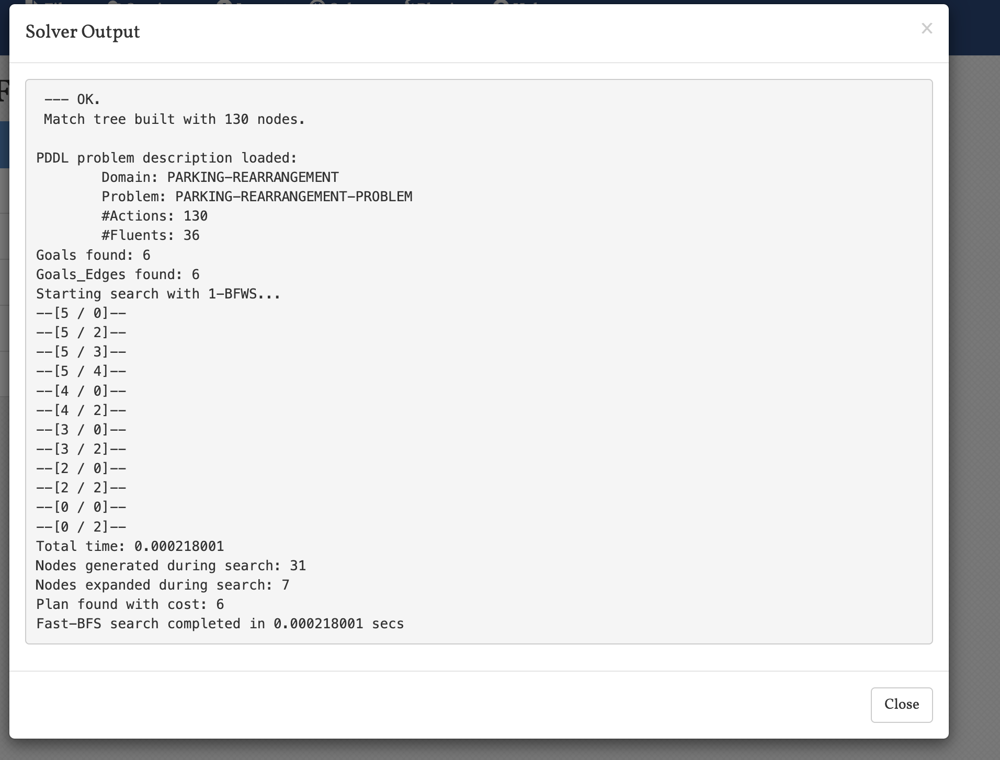
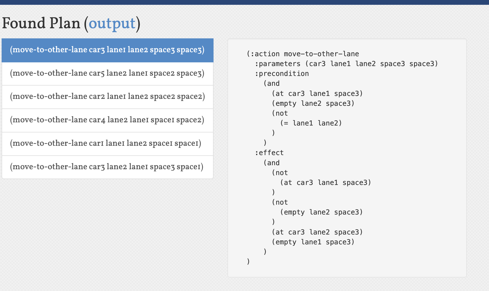

# 数值-时间规划：车辆搬运问题实验报告

## 1. 规划问题定义

### 流的描述：
- 车辆（car）：需要被搬运的对象
- 车道（lane）：车辆可以移动的通道
- 空间（space）：车道上的具体位置
- 时间（time）：每个动作执行所需的时间

### 动作描述：
1. 向右移动（move-right）：
   - 参数：车辆、车道、起始位置、目标位置
   - 前提条件：车辆在起始位置，目标位置为空，目标位置在起始位置右边
   - 效果：车辆移动到目标位置，原位置变为空

2. 向左移动（move-left）：
   - 参数：车辆、车道、起始位置、目标位置
   - 前提条件：车辆在起始位置，目标位置为空，目标位置在起始位置左边
   - 效果：车辆移动到目标位置，原位置变为空

3. 换道移动（move-to-other-lane）：
   - 参数：车辆、原车道、目标车道、原位置、目标位置
   - 前提条件：车辆在原车道原位置，目标位置为空，原车道和目标车道不同
   - 效果：车辆移动到目标车道的目标位置，原位置变为空

### 初始环境：
- 两条车道（lane1, lane2）
- 三个空间位置（space1, space2, space3）
- 五辆车（car1-car5）的初始位置分布
- 每辆车有不同的移动时间

### 目标环境：
- 车辆重新排列到指定位置
- 最小化总执行时间

### 规划生成机制：
使用 FF 规划器（Fast Forward）进行规划，该规划器支持：
- STRIPS 规划
- 类型系统
- 数值规划（尝试实现）

## 2. 规划程序设计与实现

### 介绍
1. 编程语言：PDDL（Planning Domain Definition Language）
2. 运行环境：FF 规划器

### 实现尝试过程

#### 尝试1：使用数值函数跟踪时间
我们首先尝试使用 `:numeric-fluents` 和数值函数来实现时间规划。

domain.pddl:
```pddl
(define (domain parking-rearrangement)
  (:requirements :strips :typing :fluents :numeric-fluents)
  
  (:types
    lane space car
  )
  
  (:predicates
    (at ?c - car ?l - lane ?s - space)  ; 车辆c在车道l的s位置
    (empty ?l - lane ?s - space)        ; 车道l的s位置是空的
    (right-of ?s1 ?s2 - space)          ; s1在s2的右边
  )

  (:functions
    (total-time)                        ; 总时间
    (move-time ?c - car)                ; 每辆车的移动时间
  )
  
  (:action move-right
    :parameters (?c - car ?l - lane ?s1 ?s2 - space)
    :precondition (and
      (at ?c ?l ?s1)
      (empty ?l ?s2)
      (right-of ?s2 ?s1)
    )
    :effect (and
      (not (at ?c ?l ?s1))
      (not (empty ?l ?s2))
      (at ?c ?l ?s2)
      (empty ?l ?s1)
      (assign (total-time) (+ (total-time) (move-time ?c)))
    )
  )
  ; ... 其他动作类似
)
```

problem.pddl:
```pddl
(define (problem parking-rearrangement-problem)
  (:domain parking-rearrangement)
  
  (:objects
    lane1 lane2 - lane
    space1 space2 space3 - space
    car1 car2 car3 car4 car5 - car
  )
  
  (:init
    ; 定义空间关系
    (right-of space2 space1)
    (right-of space3 space2)
    
    ; 初始状态
    (at car1 lane1 space1)
    (at car2 lane1 space2)
    (at car3 lane1 space3)
    (at car4 lane2 space1)
    (at car5 lane2 space2)
    (empty lane2 space3)

    ; 时间相关初始值
    (= (total-time) 0)
    (= (move-time car1) 2)
    (= (move-time car2) 3)
    (= (move-time car3) 2)
    (= (move-time car4) 3)
    (= (move-time car5) 2)
  )
  
  (:goal
    (and
      (at car3 lane1 space1)
      (at car4 lane1 space2)
      (at car5 lane1 space3)
      (at car1 lane2 space1)
      (at car2 lane2 space2)
      (empty lane2 space3)
    )
  )

  (:metric minimize (total-time))
)
```

结果：FF 规划器报错，不支持 `:numeric-fluents`。

#### 尝试2：使用动作成本表示时间
我们尝试使用 `:action-costs` 和动作成本来表示时间。

domain.pddl:
```pddl
(define (domain parking-rearrangement)
  (:requirements :strips :typing :fluents :action-costs)
  
  (:types
    lane space car
  )
  
  (:predicates
    (at ?c - car ?l - lane ?s - space)  ; 车辆c在车道l的s位置
    (empty ?l - lane ?s - space)        ; 车道l的s位置是空的
    (right-of ?s1 ?s2 - space)          ; s1在s2的右边
  )

  (:functions
    (move-time ?c - car)                ; 每辆车的移动时间
  )
  
  (:action move-right
    :parameters (?c - car ?l - lane ?s1 ?s2 - space)
    :precondition (and
      (at ?c ?l ?s1)
      (empty ?l ?s2)
      (right-of ?s2 ?s1)
    )
    :effect (and
      (not (at ?c ?l ?s1))
      (not (empty ?l ?s2))
      (at ?c ?l ?s2)
      (empty ?l ?s1)
    )
    :cost (move-time ?c)
  )
  ; ... 其他动作类似
)
```

problem.pddl:
```pddl
(define (problem parking-rearrangement-problem)
  (:domain parking-rearrangement)
  
  (:objects
    lane1 lane2 - lane
    space1 space2 space3 - space
    car1 car2 car3 car4 car5 - car
  )
  
  (:init
    ; 定义空间关系
    (right-of space2 space1)
    (right-of space3 space2)
    
    ; 初始状态
    (at car1 lane1 space1)
    (at car2 lane1 space2)
    (at car3 lane1 space3)
    (at car4 lane2 space1)
    (at car5 lane2 space2)
    (empty lane2 space3)

    ; 时间相关初始值
    (= (move-time car1) 2)
    (= (move-time car2) 3)
    (= (move-time car3) 2)
    (= (move-time car4) 3)
    (= (move-time car5) 2)
  )
  
  (:goal
    (and
      (at car3 lane1 space1)
      (at car4 lane1 space2)
      (at car5 lane1 space3)
      (at car1 lane2 space1)
      (at car2 lane2 space2)
      (empty lane2 space3)
    )
  )

  (:metric minimize (total-cost))
)
```

结果：FF 规划器报错，不支持 `:action-costs`。

#### 尝试3：回退到基本 STRIPS 规划
由于前两次尝试都失败了，我们回退到基本的 STRIPS 规划。

domain.pddl:
```pddl
(define (domain parking-rearrangement)
  (:requirements :strips :typing)
  
  (:types
    lane space car
  )
  
  (:predicates
    (at ?c - car ?l - lane ?s - space)  ; 车辆c在车道l的s位置
    (empty ?l - lane ?s - space)        ; 车道l的s位置是空的
    (right-of ?s1 ?s2 - space)          ; s1在s2的右边
  )
  
  (:action move-right
    :parameters (?c - car ?l - lane ?s1 ?s2 - space)
    :precondition (and
      (at ?c ?l ?s1)
      (empty ?l ?s2)
      (right-of ?s2 ?s1)
    )
    :effect (and
      (not (at ?c ?l ?s1))
      (not (empty ?l ?s2))
      (at ?c ?l ?s2)
      (empty ?l ?s1)
    )
  )
  ; ... 其他动作类似
)
```

problem.pddl:
```pddl
(define (problem parking-rearrangement-problem)
  (:domain parking-rearrangement)
  
  (:objects
    lane1 lane2 - lane
    space1 space2 space3 - space
    car1 car2 car3 car4 car5 - car
  )
  
  (:init
    ; 定义空间关系
    (right-of space2 space1)
    (right-of space3 space2)
    
    ; 初始状态
    (at car1 lane1 space1)
    (at car2 lane1 space2)
    (at car3 lane1 space3)
    (at car4 lane2 space1)
    (at car5 lane2 space2)
    (empty lane2 space3)
  )
  
  (:goal
    (and
      (at car3 lane1 space1)
      (at car4 lane1 space2)
      (at car5 lane1 space3)
      (at car1 lane2 space1)
      (at car2 lane2 space2)
      (empty lane2 space3)
    )
  )
)
```

结果：基本版本可以运行，但无法实现时间规划功能。

### 规划器运行结果

在尝试3中，我们使用基本的 STRIPS 规划成功运行了规划器。以下是运行结果：


*图1：规划器输出结果，显示规划器成功找到了解决方案*


*图2：规划器找到的具体规划序列，展示了如何通过一系列移动操作达到目标状态*

从运行结果可以看出：
1. 规划器成功找到了解决方案
2. 规划序列包含了多个移动操作
3. 虽然我们无法直接优化时间，但规划器找到了动作数量较少的解决方案

## 3. 分析

### 通用性说明
1. 算法方面：
   - 支持基本的 STRIPS 规划
   - 尝试支持数值规划（时间优化）
   - 可扩展性：可以添加新的动作类型和约束

2. 规划语言方面：
   - 使用标准的 PDDL 语法
   - 支持类型系统
   - 尝试使用数值函数和动作成本

### 完备性说明
- 基本版本（无时间规划）是完备的
- 时间规划版本由于规划器限制，未能完全实现

### 计算复杂度说明
- 状态空间：与车辆数量、车道数量和空间位置数量相关
- 动作数量：每个车辆在每个位置都有多个可能的移动选项
- 时间规划增加了状态空间的复杂度

### 正确性说明
- 基本版本：动作定义正确，能够找到有效解
- 时间规划版本：由于规划器限制，未能完全验证

### 最优性
- 基本版本：规划器会尝试找到动作数量最少的解
- 时间规划版本：未能实现时间最优

### 不足说明：
1. 规划器限制：
   - FF 规划器不支持 `:numeric-fluents` 和 `:action-costs`
   - 无法直接实现时间规划功能

2. 实现尝试：
   - 尝试1：使用 `:numeric-fluents` 和数值函数跟踪时间
   - 尝试2：使用 `:action-costs` 和动作成本表示时间
   - 尝试3：回退到基本 STRIPS 规划

3. 改进方向：
   - 使用支持数值规划的规划器（如 LAMA）
   - 考虑使用其他方式表示时间约束
   - 探索更复杂的优化目标 